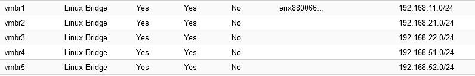

# Windows Server LAB

Widows Server 2022 LAB for practicing projects.

Table of Contents

- [Windows Server LAB](#windows-server-lab)
  - [Hardware](#hardware)
  - [Software](#software)
  - [Network Diagram](#network-diagram)
  - [VM Specification](#vm-specification)
  - [Network](#network)
  - [Microsoft Windows Server LAB Check List](#microsoft-windows-server-lab-check-list)

## Hardware

* Dell OptiPlex 7060
* CPU - Intel Core i7-8700
* RAM - 40 GB
* OS and ISO - NVME SSD 256 GB
* VMs - SATA SSD 2 TB

## Software

* **Proxmox VE** is used as Hypervisor.

* **PFSENSE** is used as router to connect networks.

* **Windows Server 2022 Trial** is used for Sever OS.
  
* **MobaXTerm** is used for Remote Desktop Client.

* **Firewall** is turned off on each server.

## Network Diagram

Two domain names, SIG.local and MYN.local will be used.

192.168.11.2 is to access two networks through Remote Desktop.

## VM Specification

Each Windows Server VM
* CPU - 1
* RAM - 4 GB
* Storage - 80 GB

Each Windows 10 VM

* CPU - 1
* RAM - 4 GB
* Storage - 60 GB

PFSENSE Firewall

* CPU - 1
* RAM - 2 GB
* Storage - 20 GB

## Network

There are 5 networks.

| Interface | Network | Description |
| --- | --- | --- |
| vmbr1 | 192.168.11.0/24 | For accessing VMs through remote desktop |
| vmbr2 | 192.168.21.0/24 | SIG.local Network
| vmbr3 | 192.168.22.0/24 | MYN.local Network
| vmbr4 | 192.168.51.0/24 | For SIG-SRV1 and SIG-SRV2 private network |
| vmbr5 | 192.168.52.0/24 | For SIG-SRV1 and SIG-SRV2 private network |

## Microsoft Windows Server LAB Check List

- [x] [Setup SIG-DC1 as DC by installing ADDS, DNS](./win-svr-lab/Setup%20SIG-DC1%20as%20DC%20by%20installing%20ADDS,%20DNS.md)
- [x] [Install and configure DHCP on SIG-DC1](./win-svr-lab/Install%20and%20configure%20DHCP%20on%20SIG-DC1.md)
- [x] [AD Users, Computers and OUs](./win-svr-lab/AD%20Users%20Computers%20and%20OUs.md)
- [x] [Joining Domain](/win-svr-lab/Joining%20Domain.md)
- [ ] [Deploy Windows 10 Using MDT](./win-svr-lab/Deploy%20Windows%2010%20Using%20MDT.md)