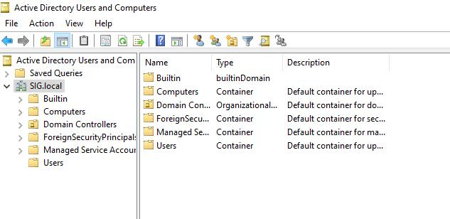
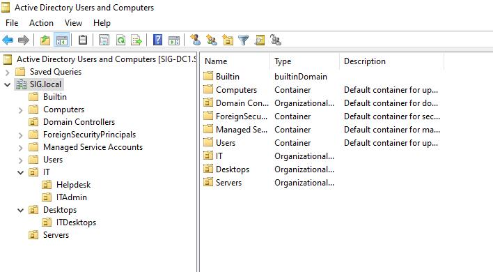
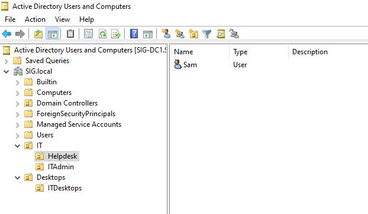
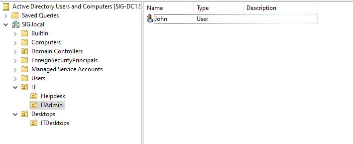
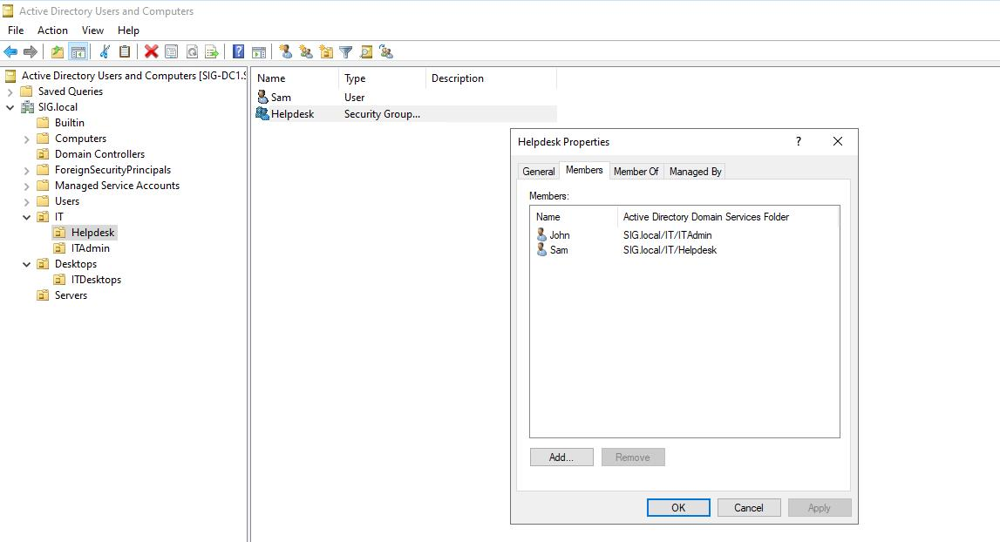
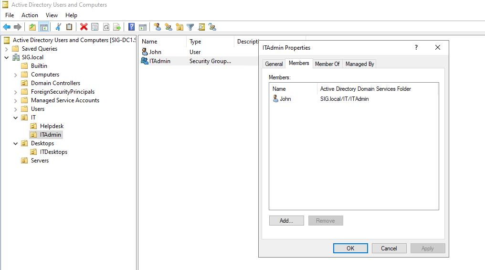
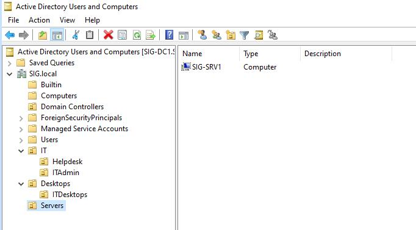

# AD Users, Computers and OUs

In order to access related resources within domain, accounts such as users, computers and groups will be needed.

In this section, below will be included.

1. Information for AD Users and Computers
2. LAB for AD Users, Computers and OUs

## Information for AD Users and Computers

### User and Computer Accounts

User or Computer accounts (mostly user accounts) must be created in order to provide network resources access by authenticating Domain.

### Group

When each department needs certain permissions, assigning permissions on groups are more useful than assigning on individual user accounts.

There are two types of Groups.

1. Security - It is to assign permissions for accessing resources.
2. Distribution - It is mainly used for Email.

There are four group scopes for range of group's abilities.

1. Local - You use this type of group for standalone servers or workstations, on domain-member servers that are not domain controllers, or on domain-member workstations. Local groups are available only on the computer where they exist. The important characteristics of a local group are:
    * You can assign abilities and permissions on local resources only, meaning on the local computer.
      * E.g. Sometime local administrator right is needed to be assgined to certain user.
    * Members can be from anywhere in the AD DS forest.

2. Domain-local. You use this type of group primarily to manage access to resources or to assign management rights and responsibilities. Domain-local groups exist on domain controllers in an AD DS domain, and so, the group’s scope is local to the domain in which it resides. The important characteristics of domain-local groups are:
    * You can assign abilities and permissions on domain-local resources only, which means on all computers in the local domain.
    * Members can be from anywhere in the AD DS forest.

3. Global. You use this type of group primarily to consolidate users who have similar characteristics. For example, you might use global groups to join users who are part of a department or a geographic location. The important characteristics of global groups are:
    * You can assign abilities and permissions anywhere in the forest.
    * Members can be from the local domain only and can include users, computers, and global groups from the local domain.

4. Universal. You use this type of group most often in multidomain networks because it combines the characteristics of both domain-local groups and global groups. Specifically, the important characteristics of universal groups are:
    * You can assign abilities and permissions anywhere in the forest similar to how you assign them for global groups.
    * Members can be from anywhere in the AD DS forest.

More information can be seen [here](https://learn.microsoft.com/en-us/training/modules/introduction-to-ad-ds/3-define-users-groups-computers).

### Organizational Units (OUs)

Organizational Unit (OU) is a container object within a domain that user, computers, groups, and other objects can be consolidated.

OU can be created to organize user, computers, groups, and other objects.
* E.g. For Account Department, Account OU can be created to organize related user, computers, groups, and other objects.
* OU can be created in existing OU to make hierarchical desgin and it is called Nested OU.

Group policies can be linked to manage related OUs.

There are built-in OUs.

See more [here](https://learn.microsoft.com/en-us/training/modules/introduction-to-ad-ds/5-define-organizational-units).

## LAB for AD Users, Computers and OUs

Below users, groups and OUs will be created.

* IT (OU)
  * Helpdesk (OU)
    * Sam (user)
    * Helpdesk (group)
  * IT Admin
    * John (user)
    * ITAdmin (group)
* Desktops
  * ITDesktops (pc)
* Servers

First create OU, User and Group for IT

### Creating OUs

1. On Server Manager, click Tools &rarr; click Active Directory Users and Computers
2. Expand SIG.local or your domain
3. Right click on SIG.local or your domain &rarr; click New &rarr; click Organizational Unit &rarr; type IT in Name box &rarr; click OK
   * Note - Do not remove Protect container from accidental deletion
4. Right click on IT OU &rarr; click New &rarr; click Organizational Unit &rarr; type below OU names in Name box &rarr; click OK
   1. Helpdesk
   2. ITAdmin
5. Right click on SIG.local or your domain &rarr; click New &rarr; click Organizational Unit &rarr; type Desktops in Name box &rarr; click OK
   1. Right click on Desktops OU &rarr; click New &rarr; click Organizational Unit &rarr; type IT Desktops in Name box &rarr; click OK
6. Right click on SIG.local or your domain &rarr; click New &rarr; click Organizational Unit &rarr; type Servers in Name box &rarr; click OK

### Creating Users

1. Right click on Helpdesk &rarr; click New &rarr; click User &rarr; Fill Sam in First name and User logon name box &rarr; click Next
2. Type passwords &rarr; remove check box for User must be change password at next logon &rarr; Enable check box for Password never expires &rarr; click Next
3. Click Finish

4. Create John user account under ITAdmin OU

### Creating Groups

Helpdesk and ITAdmin groups will be created under respective OUs.

1. Right click on Helpdesk OU &rarr; click New &rarr; click Group
2. Enter as group name &rarr; For Group Scope, leave as default which is already selected Global &rarr; For Group type, leave as default which is already selected Security &rarr; click OK
3. Right click on Helpdesk Group &rarr; click Properties &rarr; click Member tab &rarr; click Add
4. Enter Sam in Enter the object names to select &rarr; click Check Names and it will change to Sam (Sam@SIG.local) if user account is existed &rarr; click OK
5. Add John user account in Helpdesk group as well

6. Once it is done, click OK
7. Create ITAdmin group and add John user under ITAdmin OU

### Creating Prestaged Computer Accounts

When computers are joined to domain, those computer accounts will be created under built-in Computers OU.

If Computers are created by creating prestaging computer accounts under related OUs, those computers will appeared under related OUs after joining Domain.

SIG-SRV1 will be created as prestaged computer accounts under Servers OU and to create prestaged computer accounts, computer name must be entered.

1. Servers OU is already created
2. Right click on Server OU &rarr; click New &rarr; click Computer and New Object - Computer window will be appeared
3. Type SIG-SRV1 in Computer Name box
   1. Note - SIG-SRV1 is computer name
4. For User or group when to enter credentials for joining Domain, leave as Default: Domain Admins Group
   1. You can change User or group that you want
5. Click OK and prestaged SIG-SRV1 is created

