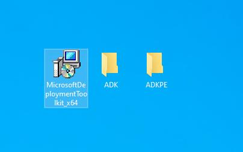

# Deploy Windows 10 Images Using MDT

Microsoft Deployment Toolkit is used to deploy Windows 10 Images by reducing time consumption.

See more information [here](https://learn.microsoft.com/en-us/windows/deployment/deploy-windows-mdt/get-started-with-the-microsoft-deployment-toolkit)

Requirements
* Windows Server VM to host MDT
  * In this lab, SIG-SRV2 will be hosted MDT
* Microsoft Deployment Toolkit Software
* Windows Assessment and Deployment Kit (Windows ADK) and Windows PE add-on

## Downloading and Installing MDT and Windows ADK and PE

1. Download MDT from this [link](https://www.microsoft.com/en-us/download/details.aspx?id=54259)
2. Download ADK and PE from this [link](https://learn.microsoft.com/en-us/windows-hardware/get-started/adk-install)
   1. As Windows 10 version in this lab is 22H2, ADK and PE for Windows 10 version are downloaded
3. As VMs are not allowed to access internet, ADK and PE will be downloaded offline installer on another computer and copy them to SIG-SRV2
   1. To download offline installer for both, run adksetup.exe and adkwinpesetup.exe respectively and select Download the Windows 10 assessment...

4. Copy MDT, ADK and PE Offline installer files to SIG-SRV2

5. Install MDT by following as default
6. Install ADK
   1. Select Install the Windows Assessment and Deployment Kit - Windows 10 and click Next
   2. For features, leave as default and click Install
7. Install ADKWINPE
   1. Select Install the Windows Assessment and Deployment Kit - Windows 10 and click Next

## Setting Up MDT

### Create Deployment Share

1. Open DeploymentWorkbench
2. Right click on Deployment Shares &rarr; New Deployment Share 
3. On Path page, Choose Path (C:DeploymentShare will be used in this lab) &rarr;; click Next 
4. On Share page, leave default share name, DeploymentShare$, and click Next
   1. You can change name as you want
5. On Description page, leave as defaut and click Next
6. On Options page, leave as default and click Next
7. On Summary page, click Next
8. On Confirmation, click Finish and new MDT Deployment will be appeared

### Create WIM File

Before creating Windows, mount Windows 10 ISO as DVD on SIG-SRV2 to extrac install.WIM file as there is no WIM file on my Windows 10 ISO

1. Copy install.esd file from D:\sources to C:\ESD
2. Open PowerShell or cmd
3. Type cd c:\ESD
4. Type DISM /Get-WimInfo /WimFile:install.esd to extract Windows 10 Pro
5. Look for Windows 10 Pro and note its index number
6. Type dism /export-image /SourceImageFile:install.esd /SourceIndex:6 /DestinationImageFile:install.wim /Compress:max /CheckIntegrity and wait for completion

7. Once it is completed, install.wim is extracted

### Add a reference image

1. Open DeploymentWorkbench
2. Expand DeploymentShare
3. Right click on Operating Systems &rarr; click Import Operating System and Import Operating System Wizard will be appeared
4. On OS Type, select Custom image and click Next
5. On Image, click Browse to select Source &rarr; Select C:\ESD\install.wim &rarr; click OPEN &rarr; click Next
6. On Setup, select Setup files are not needed &rarr; click Next
7. On Destination, leave as default or type name as you want &rarr; click Next
8. On Summary, click Next again
9. Wait for completion
10. On Confirmation, click Finish and Windows 10 Pro install.wim is created

### Adding application to image

Applications that you want can be added to install on image

1. Noteplusplus installer is downloaded and save it in C:\Noteplusplus folder
2. Open DeploymentWorkbench &rarr; Expand DeploymentShare &Rarr; right click on Applications and New application Wizard will be opened
3. On Application Type, select Application with source files &rarr; click Next
4. Fill software information for Details &rarr; click Next

5. On Source, click Browse &rarr; select C:\Noteplusplus folder &rarr; click Next
6. On Destination, specify name for folder to be created &rarr; click Next
7. On Command details, add information as below or add you want &rarr; click Next

8. On Summary, click Next again
9. On confirmation, click Finish

### Adding Task Sequences

Add deployment task sequences

1. Open DeploymentWorkbench
2. Expand DeploymentShare &rarr; right click Task Sequence &rarr; click New Task Sequence and New Task Sequence Wizard
3. On General Settings, type 101 for Task sequence ID and type MDTW10 for Task sequence name &rarr; click Next
4. On Select Template, select Standard Client Task Sequence as deploying W10 &rarr; click Next
5. On Select OS, select OS &rarr; click Next
6. On Specify Product Key, select Do not specify a product key at this time and click Next
7. On OS Settings, Type User as full name and type SIG in Organization &rarr; click Next
8. On Admin Password, type password and click Next
9. On Summary, click Next
10. On Confirmation, click Finish

11. Double click on MDTW10 &rarr; click Task Sequence Tab &rarr; click Install Applications task &rarr; select Install a single application &rarr; click Browse &rarr; select NotePluPlus &rarr; click OK &rarr; click Apply and OK

### Update Deployment Share

To get image, Deployment share is needed to be updated.

1. Right click on MDT Deployment Share &rarr; click Update Deployment Share and Update Deployment Share will be opened
2. On Options, click Next by keeping as default
3. On Summary, click Next again
4. And wait for completion

I have encountered an error like Unable to mount WIM and it was worked again by closing DeploymentWorkbench and reopening as administrator

5. Once it is completed, you can save output and click Finish
6. After that, LiteTouchPE_x64.iso will be appeared in C:\DeploymentShare\Boot folder

### Creating Windows 10 VM using LiteTouchPE_64.iso

LitetouchPE_x64 is uploaded to Proxmox ISO folder.

1. Click Run the Deployment Wizard to install a new Operating System

2. Fill SIG domain account credentials to access Deployment Share folder &rarr; click OK

3. On Task Sequence, select MDTW10 task sequence &rarr; click Next

4. On Computer Details, SIG-PC2 as computer name and select Join a domain &rarr; fill as below &rarr; click Next

5. On Move Data and Settings and User Data, stay as default and click Next
6. On Locale and Time, adjust time and timezone &rarr; click Next
7. On Bitlocker, stay as default (do not enable bitlocker) and click Next
8. On Ready, click Begin