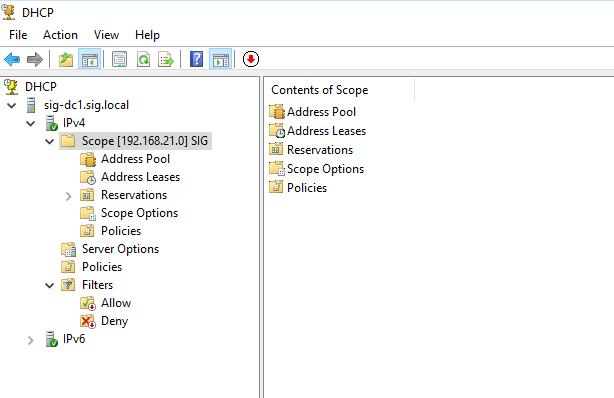
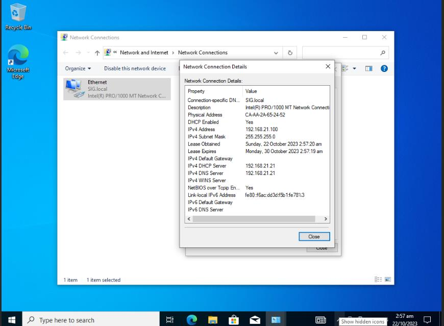
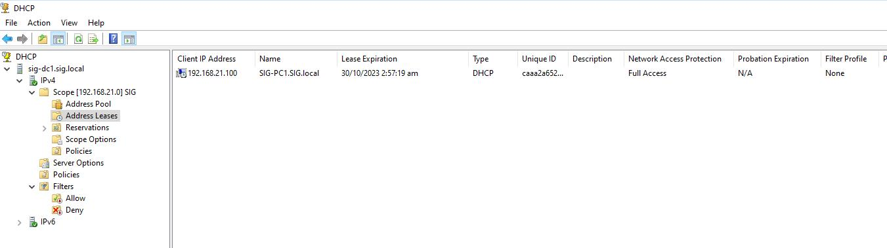

# Install and configure DHCP on SIG-DC1

SIG-DC1 will be acting as DHCP for desktop clients.

## Installation of DHCP Server

1. Click Manage on Top right corner of Server Manager &rarr; Click Add Roles and Features and Add Roles and Features Wizard will be prompted.

2. Click Next &rarr; Select Role-based or feature-based installation &rarr; click Next

3. For Server Selection, remain as default and click Next

4. For Server Roles, click DHCP Server &rarr; click Add Features &rarr; click Next

5. For Features, click Next again

6. For DHCP Server, click Next again

7. For Confirmation, click Install &rarr; click Close once installation is completed

8. Click Exclamation mark near top right corner &rarr; click Complete DHCP Configuration and DHCP Post-Install configuration wizard will be appeared

9. On Description, click Next

10. On Authorization, use Administrator's credentials as default &rarr; click Commit

11. On Summary, click Close

## Configuration of DHCP Server

1. Click Tools &rarr; click DHCP and DHCP Window will be appeared

2. Expand SIG.local &rarr; Expand IPv4 as we are using IPv4

3. Right click on IPv4 &rarr; click New Scope and New Scope Wizard will be appeared

4. On Welcome page, click Next

5. SIG will be used as scope name and type SIG in name box and type DHCP for SIG in  description box &rarr; click Next

6. On IP Address Range, 192.168.21.100 as start IP address and 192.168.21.200 as end of IP address &rarr; for subnet mask, it will change automatically by referring to network or change as you want &rarr; click Next

7. On Add Exclusions and Delay, click Next as no need to configure

8. On Lease Duration, set lease duration as default 8 hours &rarr; click Next

9. Select Yes, I want to configure these options now to configure gateway an DNS for dhcp clients &rarr; click Next

10. On Router (Defaut Gateway), type 192.168.21.1 which is interface of PFSENSE &rarr; click Next

11. For DNS server, as it is using SIG.local domain, DNS server is already appeared &rarr; check if it is correct &rarr; click Next

12. For WINS Servers, click Next as no need to configure

13. Select Yes, I want to activate this scope now &rarr; click Next

14. Click Finish to close Scope Wizard

15. After that, Scope will be appeared under IPv4

16. After a few minutes waiting, SIG-PC1 is getting DHCP IP Address from DHCP Server

17. If Address Leases under DHCP scope is opened, DHCP client will be appeared there

18. Install and configure DHCP on MYN-DC1 for MYN network