# Joining Domain

To control all computers by centralization in the network, those computers must be joined domain.

## Without Creating Prestaged Computer Account

Domain can be joined from System Properies by entering domain name in Domain box and entering credentials.

For this method, MYN.local domain and DHCP is already created on MYN Network.

To joing MYN-PC1 to MYN.local domain,

1. Click Setting &rarr; click About &rarr; click Advanced system settings
2. Click Computer Name tab &rarr; click Change &rarr; Select Domain &rarr; Type MYN.local under Domain &rarr; click OK

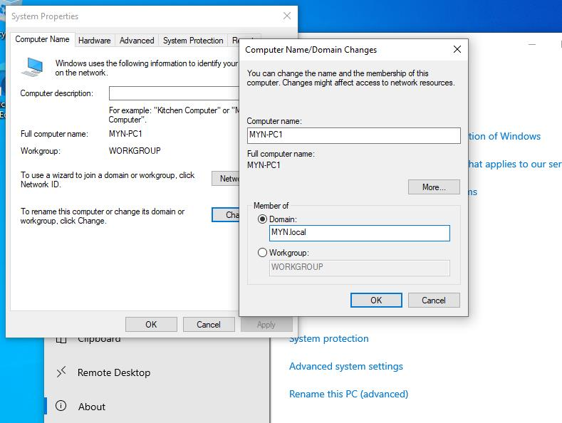

3. Enter credentials of MYN Administrator &rarr; click OK

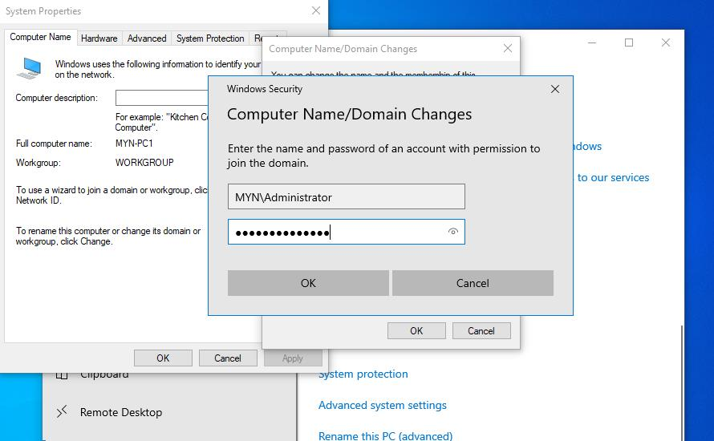

4. Click OK on Compute Name/Domain Chages &rarr; click OK to restart &rarr; click Close on System Properties &rarr; click Restart Now

5. Once computer is restarted, log in with MYN user credentials and joining domain method 1

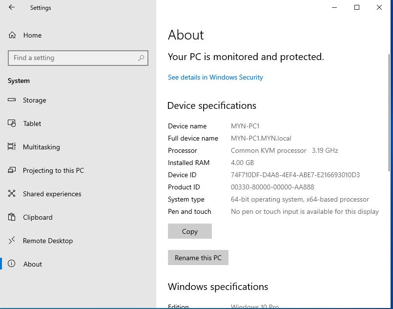

6. MYN-PC1 computer account will be created under built-in Computers OU

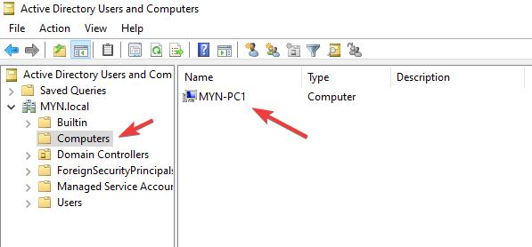

## With Creating Prestaged Computer Account

With creating Prestaged Computer Account, those computers can be organized without trouble in future.

1. Create SIG-PC1 Prestaged account by refeering [here](/win-svr-lab/AD%20Users%20Computers%20and%20OUs.md)

   1. When creating prestaged accounts, use Helpdesk group for joining desktops to domain

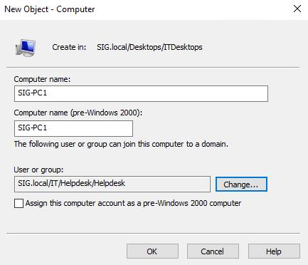

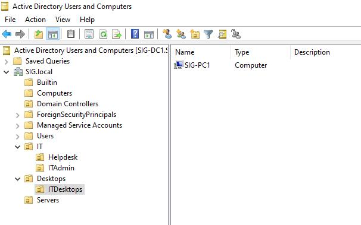

2. Now join domain as above steps on SIG-PC1
   1. When joining domain, use credentials of Helpdesk user account Sam

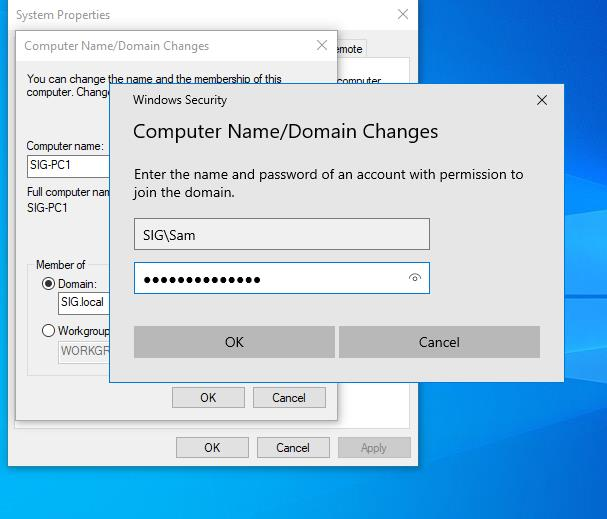

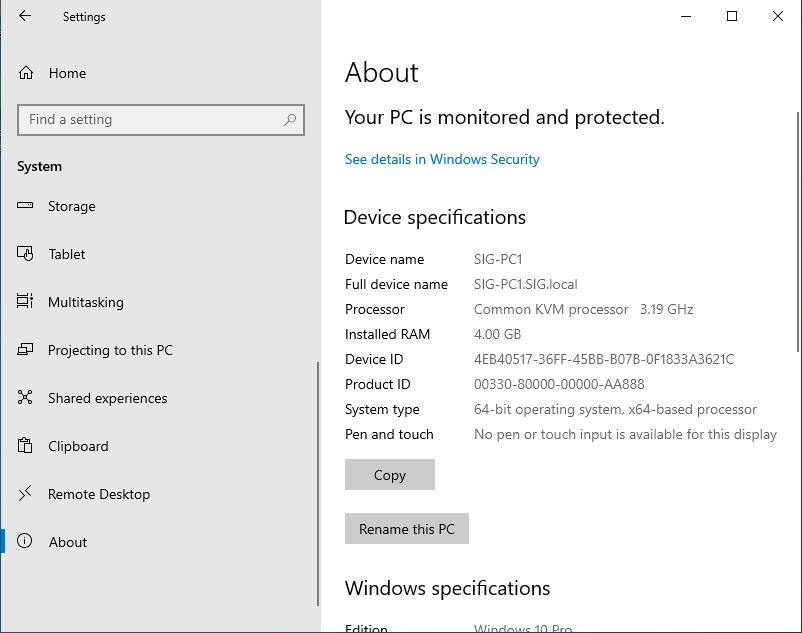

3. If you see in built-in Computers OU, there is no computer account as it is created under ITDesktops OU as prestaged account.

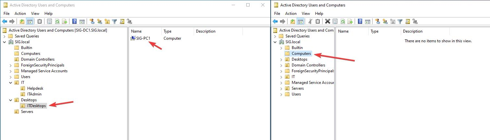

4. Create prestaged SIG-CORE1, SIG-SRV2 and SIG-WEB1 accounts under Servers OU to organize Servers by assigning ITAdmin group to join domain

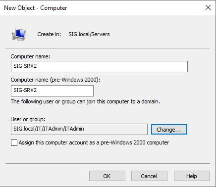

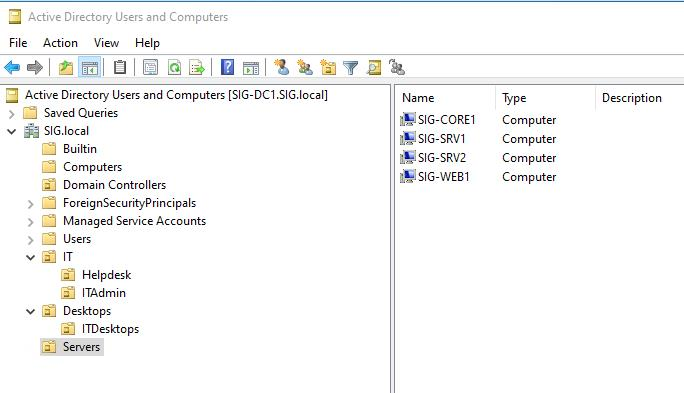

5. Join those serves and SIG-SRV1 to SIG.local Domain

* Note - When joining SIG-SRV1 to SIG.local, use administrator credentials
For SIG-SRV2 and SIG-WEB1, user John user account's credentials

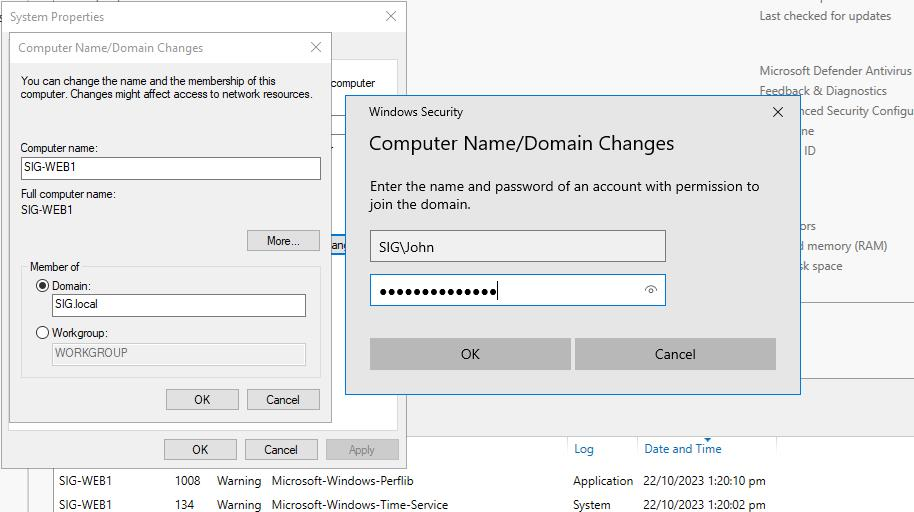

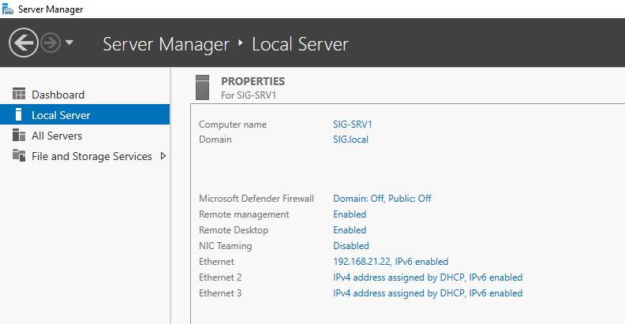

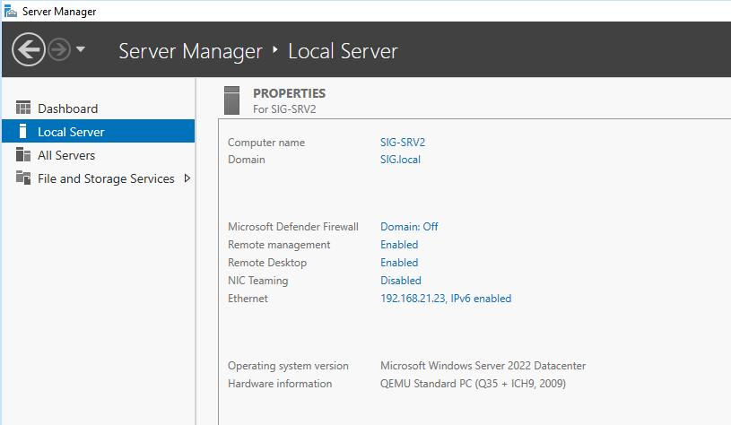

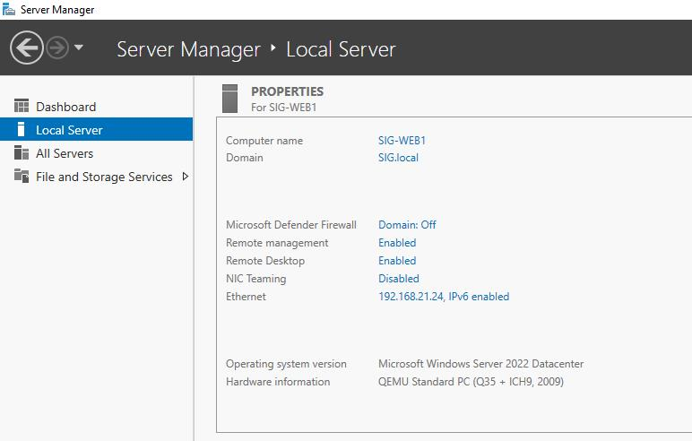

6. Join SIG-CORE1 to SIG.local by using John user account
   1. Type sconfig if it is not started
   2. Type 1 and press Enter to select 1) Domain/Workgroup option
   3. Type D and press Enter
   4. Type SIG.local for Name of Domain and press Enter
   5. Type Credentials for John account
   6. Once it is joined successfully, click Yes to restart computer
   7. Select option 13 to restart computer
   8. Once it is restarted, sign in with related credentials of SIG.local

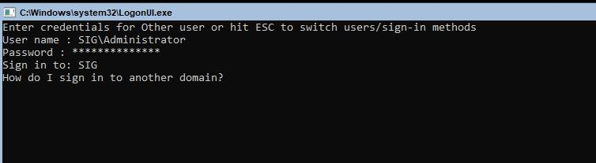

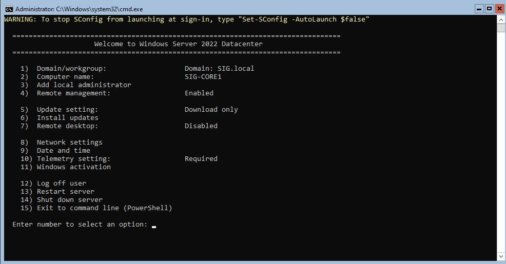

7.. There is still no computer accounts in built-in Computers OU as accounts are created in Servers OU as prestaged computer accounts

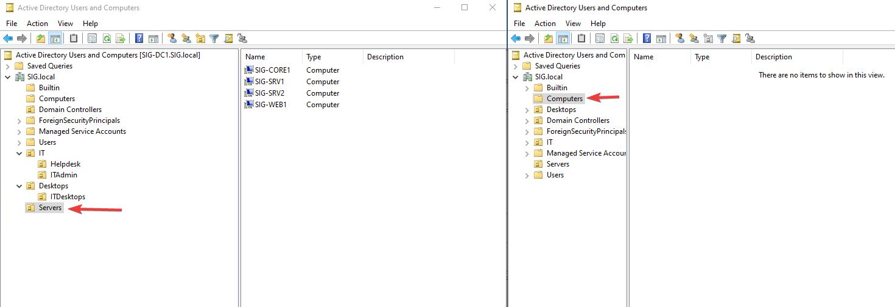