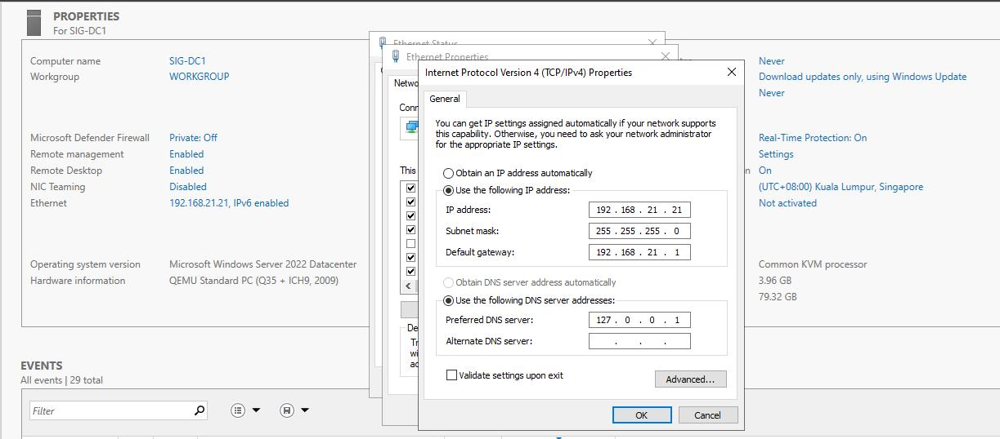
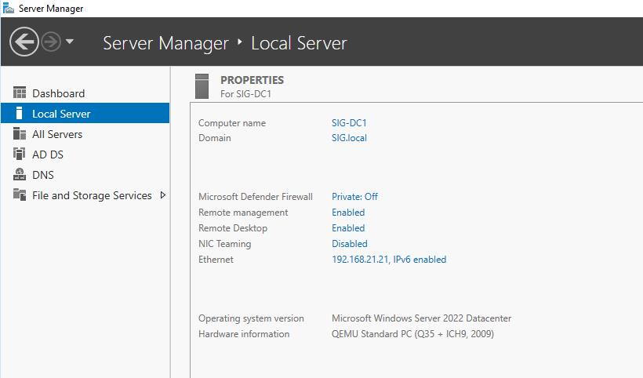

# Setup SIG-DC1 as DC by installing ADDS, DNS

Setting up first domain controller in this lab by doing below steps.

1. Preparation for Domain Controller
2. Installing Active Directory Domain Services (ADDS) Role and DNS Role
3. Promote Domain Controller

## Preparation for Domain Controller

Before installing ADDS, set below list.

1. Static IP Address
2. Hostname
3. DNS Server by pointing its IP or localhost for Preferred DNS Server and another DC as Alternate DNS Server
    * Another DC have not set up yet.

## Installing Active Directory Domain Services (ADDS) Role and DNS Role

To become DC, ADDS and DNS are needed to be installed.

Why should DNS be installed on DC?

As per Microsoft Document [Here](https://learn.microsoft.com/en-us/windows-server/identity/ad-ds/plan/dns-and-ad-ds) and [Here](https://learn.microsoft.com/en-us/windows-server/identity/ad-ds/plan/active-directory-integrated-dns-zones),

* Active Directory Domain Services (AD DS) uses Domain Name System (DNS) name resolution services to make it possible for clients to locate domain controllers and for the domain controllers that host the directory service to communicate with each other.

* AD DS enables easy integration of the Active Directory namespace into an existing DNS namespace. Features such as Active Directory-integrated DNS zones make it easier for you to deploy DNS by eliminating the need to set up secondary zones, and then configure zone transfers.

* Domain Name System (DNS) servers running on domain controllers can store their zones in Active Directory Domain Services (AD DS). In this way, it is not necessary to configure a separate DNS replication topology that uses ordinary DNS zone transfers because all zone data is replicated automatically by means of Active Directory replication.

To install ADDS and DNS Roles,

1. Click Manage on Top right corner of Server Manager &rarr; Click Add Roles and Features and Add Roles and Features Wizard will be prompted.

2. Click Next &rarr; Select Role-based or feature-based installation &rarr; click Next

3. For Server Selection, remain as default and click Next

4. For Server Roles, click Active Directory Domain Services &rarr; click Add Features &rarr; click DNS Server &rarr; click Add Features again &rarr; Click Next

5. For Features, click Next to continue

6. For ADDS, click Next again to continue

7. For DNS, click Next again to continue

8. For confirmation, review it and click Install if it is correct &rarr; click Close once it is completed

## Promote Domain Controller

Once AADDS and DNS installation is completed, promote server to become DC.

1. Click exclamation mark on near top right corner of Server Manager

2. Click Promote this server to a domain controller and Active Dircetory Domain Services Configuration Wizard will be prompted

3. On Deployment Configuration page on Active Dircetory Domain Services Configuration Wizard, click Add a new forest as it is first domain controller
   * Forest - A forest is a top-level container in AD DS. Each forest is a collection of one or more domain trees that share a common directory schema and a global catalog.
   * Domain Tree - A domain tree is a collection of one or more domains that share a contiguous namespace. The forest root domain is the first domain that you create in the forest.
   * Domain - An AD DS domain is a logical container for managing user, computer, group, and other objects. The AD DS database stores all domain objects, and each domain controller stores a copy of the database.
   * Click [Here](https://learn.microsoft.com/en-us/training/modules/introduction-to-ad-ds/4-define-forests-domains?ns-enrollment-type=learningpath&ns-enrollment-id=learn.wwl.active-directory-domain-services) for more information about Forest and Domain

4. Enter Root Domain Name &rarr; click Next
    * SIG.local domain name will be used in this lab as mentioned before

5. On Domain Controller Options, Type password for Directory Services Restore Mode (DSRM) &rarr; click Next
    * This password is very important for restoring DSRM

6. On DNS options, just click Next as there is nothing much to choose as this is first DC

7. On Additional Options, just click Next by leaving as default

8. On Paths, leave as default and click Next
   * Some people may choose other drives for storing ADDS database files

9. On Review Options, you may check your select and click Next

10. On Prerequisites Check, click Install if all prerequisite checks passed successfully
    * Once installation is completed, server will be restarted

11. After server is restared, login as SIG\Administrator and setting up First DC is completed.

12. Create Domain of MYN.local on MYN-DC1